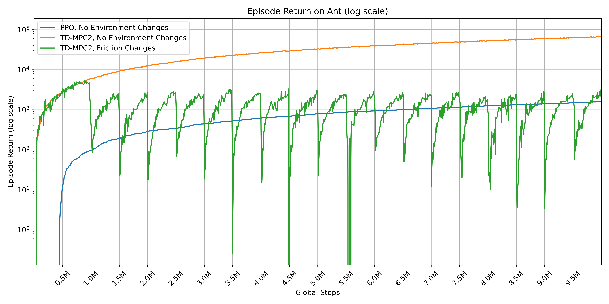

# tdmpc2-jax + brax

A re-implementation of [TD-MPC2](https://www.tdmpc2.com/) in Jax/Flax. JIT'ing the planning/update steps makes training 5-10x faster than the original PyTorch implementation while maintaining similar or better performance in challenging continuous control environments. Using Brax as the backend for the environments allows for faster simulation, making simulation no longer the bottleneck in training, resulting in another 2-3x speedup in training time compared to using gymnasium environments.

This repository also supports vectorized environments (see the env field of ```config.yaml```) and finite-horizon environments (see ```world_model.predict_continues``` and ```tdmpc.continue_coef``` in ```config.yaml```).

<!-- centered image -->
<p align="center">
  
</p>

## Usage

To install the dependencies for this project (tested on Ubuntu 22.04), run
```[bash]
pip install --upgrade -r requirements.txt
```

Then, edit `config.yaml` and run `train.py` in the main project directory. Some examples:
```[bash]
python train.py env.backend=mjx env.env_id=ant
```

### Slurm/Brown CCV Usage
Replace ``train.py` with `launch.sh` and launch with `sbatch` instead of `python`.


## TODO
- [x] Organize modifiable environments into `envs/` package.
- [ ] Add support for more environments (Cheetah, Humanoid, etc).
- [ ] Run experiments on more environments.


## Experiments
- [ ] Predict n-th state
- [ ] World variables
- [ ] EMA world model
